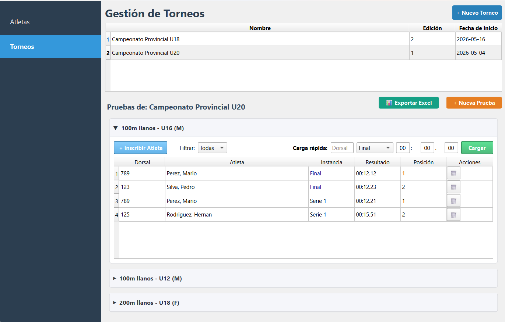

## 📖 Documentación

La documentación técnica se genera mediante **Doxygen**. Para generarla localmente:
1.  Asegúrate de tener Doxygen instalado.
2.  Ejecuta: `doxygen Doxyfile`.
3.  Abre `docs/html/index.html` en tu navegador.

## 🛡️ CI/CD

Este proyecto incluye un flujo de trabajo de **GitHub Actions** que automatiza las pruebas en cada `push` o `pull_request` sobre la rama principal, garantizando la estabilidad del software.

## 📄 Licencia

Este proyecto está bajo la Licencia MIT - mira el archivo [LICENSE](LICENSE) para detalles.

---

# Atletismo 🏃‍♂️🏆

Sistema para torneos de atletismo, desarrollado con **Python** y **PySide6**. Esta aplicación permite administrar atletas, organizar torneos por categorías y sexos, registrar resultados en tiempo real y generar reportes oficiales en Excel.

## 🚀 Características Principales

*   **Gestión de Atletas:** Registro completo de deportistas con validación de DNI y Club.
*   **Organización de Torneos:** Creación de eventos personalizados con múltiples pruebas (100m, 200m, etc.).
*   **Carga Rápida de Tiempos:** Interfaz optimizada para cronometraje manual con entrada por bloques (MM:SS.CC).
*   **Posicionamiento Dinámico:** Cálculo automático de posiciones (1, 2, 3...) filtrado por series o finales.
*   **Reportes Profesionales:** Exportación a Excel con formato jerárquico.

## Interfaz




## 🛠️ Tecnologías Utilizadas

*   **Lenguaje:** Python 3.11+
*   **Interfaz Gráfica:** PySide6 (Qt for Python)
*   **Base de Datos:** SQLite
*   **Reportes:** Openpyxl
*   **Tests:** Pytest
*   **Documentación:** Doxygen
*   **CI/CD:** GitHub Actions

## 📦 Instalación y Configuración

1.  **Clonar el repositorio:**
    ```bash
    git clone https://github.com/raikot365/athletics.git
    cd athletics
    ```

2.  **Crear y activar un entorno virtual:**
    ```bash
    python -m venv venv
    # En Windows:
    venv\Scripts\activate
    # En Linux/Mac:
    source venv/bin/activate
    ```

3.  **Instalar dependencias:**
    ```bash
    pip install -r requirements.txt
    ```

4.  **Ejecutar la aplicación:**
    ```bash
    python main.py
    ```

## 🧪 Pruebas

Para ejecutar la suite de pruebas automatizadas:
```bash
pytest tests/
